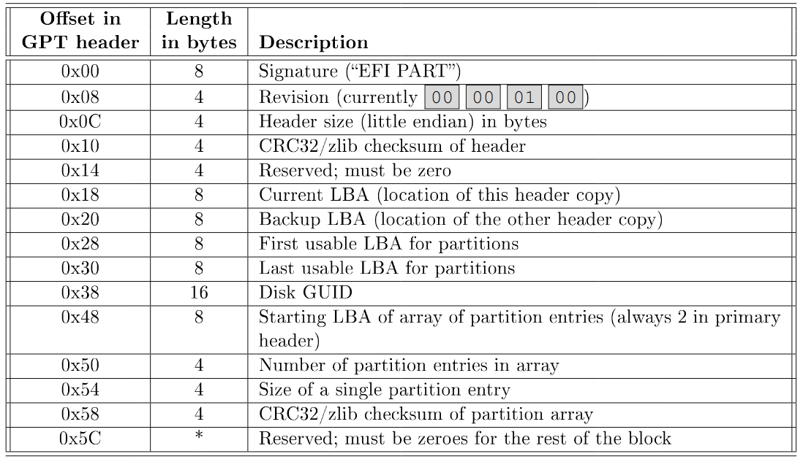
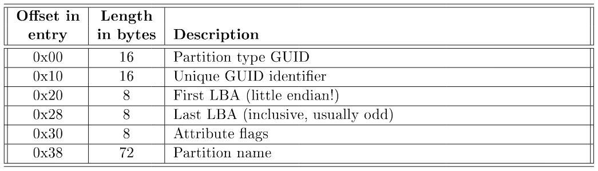
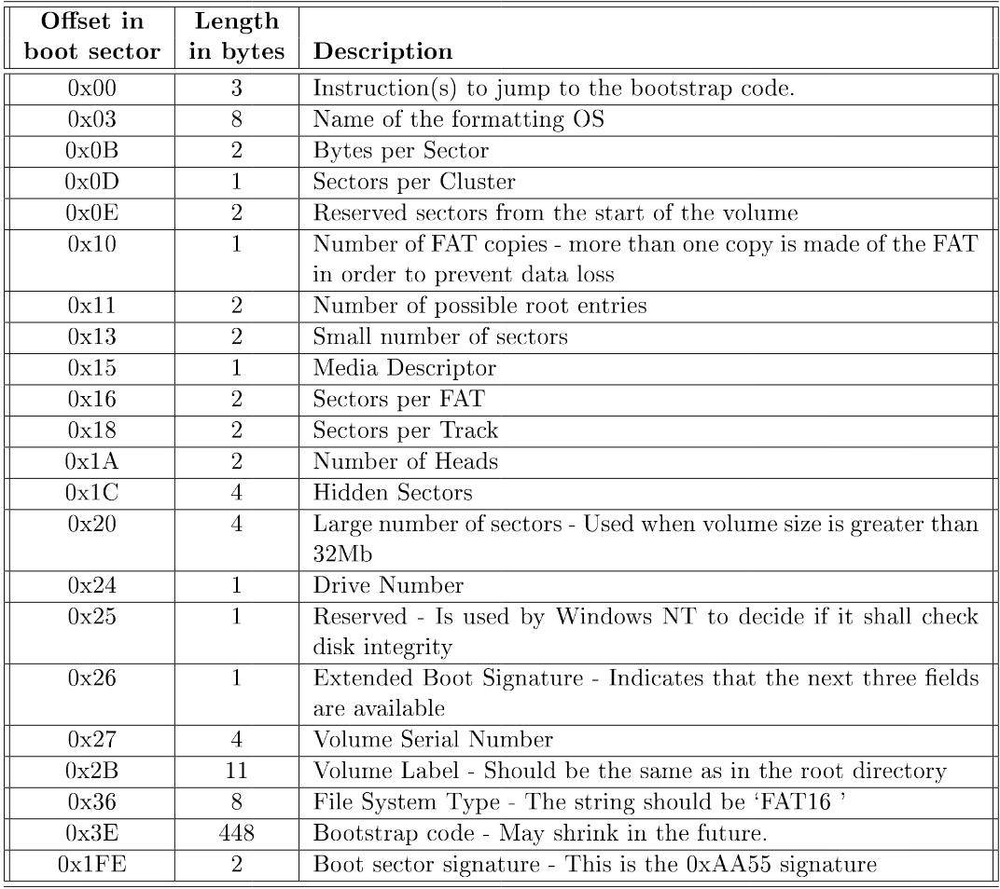
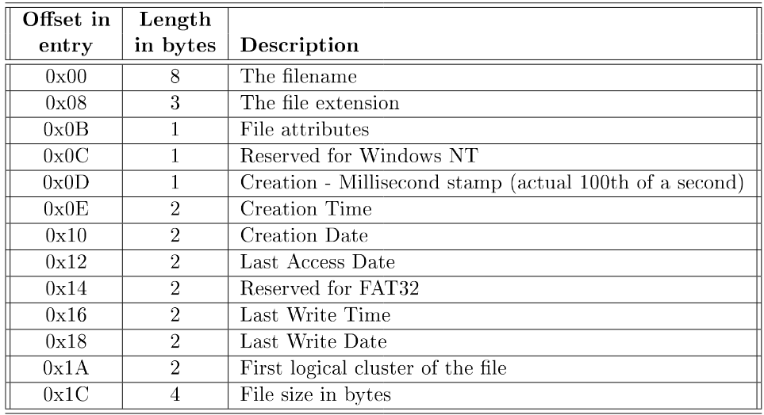

# FAT16
This repo contains a few things to help you find / calculate FAT16 properties, ...

## Disclaimer
The info in this repo may contain errors. Please do not rely on this and always check it for yourself!

## Table of contents
- [GPT Header](#gpt-header)
- [GPT Entry](#gpt-entry)
- [Boot Sector](#boot-sector)
-  - [Disk Layout](#disk-layout)
- [Files & Directories](#files)
-  - [Time](#time)
-  - [Date](#date)
- [Sources](#sources)

## GPT Header

## GPT Partition Entry

## Boot Sector

### Disk Layout
- Boot Sector Address [HEX] = `First LBA` (GPT Entry, DEC) * `512`
- Size of cluster [BYTES] = `Bytes per sector` * `Sectors per cluster`
- First FAT Address [HEX] = `Boot Sector Address` + `Size of cluster` [IN DEC]
- Root Directory Address = First FAT Address + (`Small number of sectors` * `Sectors per cluster`) [HEX]
- Root Directory Size [BYTES] = `Number of possible root entries` * `Directory Entry size`  (often 32 bytes)
- Data Region Address = `Root Directory Address` + `Root Directory Size` [IN HEX]
- Total FAT16 Volume in Bytes = `Small number of sectors` * `Bytes per sector`

## Files

- To find the next cluster index = `First FAT Address` + `Previous Cluster` * 2
- File contents of the cluster = `Start of data region` + `cluster_size` * `(cluster_index - 2)`

### Time
1. First 5 bits for hours
2. Next 6 bits for minutes
3. Last 5 bits for seconds (you have seconds multiply by 2 to get the value, eg.: 00011 => 3, 3 * 2 => 6 seconds)

### Date
1. First 7 bytes years since 1980 (eg.: if value in dec is 28, 1980 + 28 = 2008)
2. Next 4 bits for the month
3. Last 5 bits for the day

## Sources
- UCLL
- Pieter Philippaerts